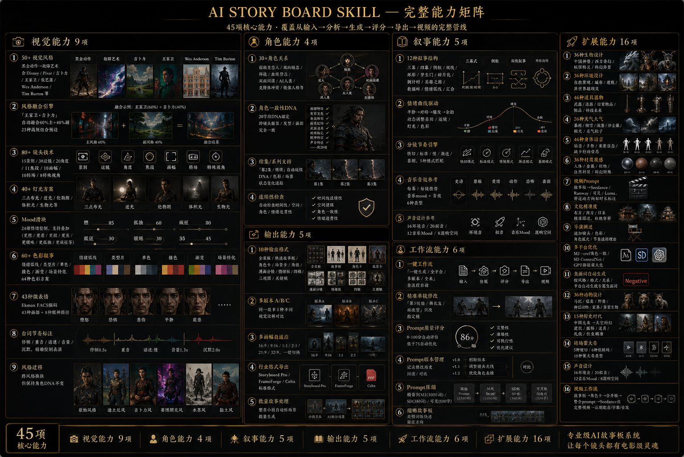
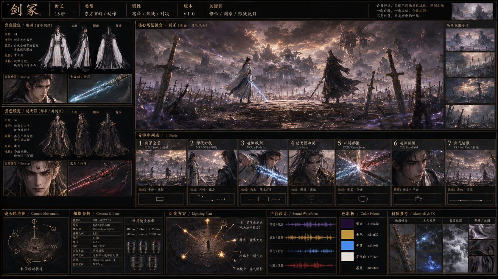
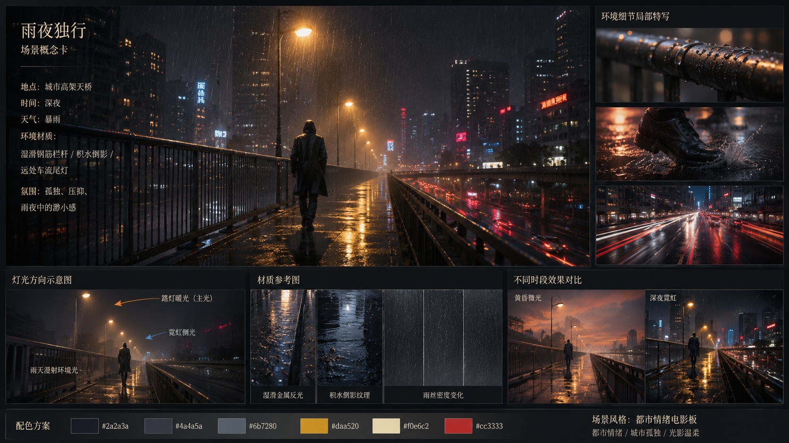
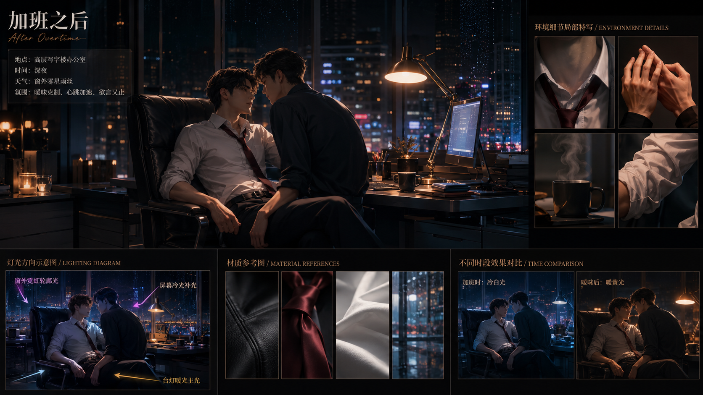
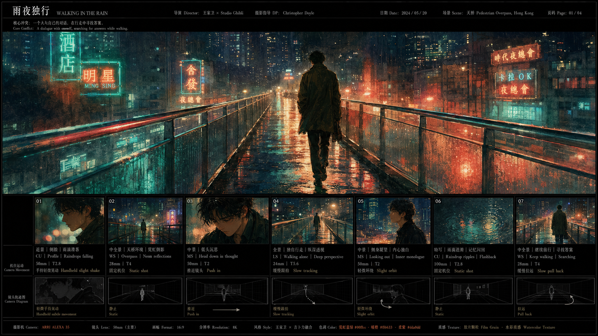
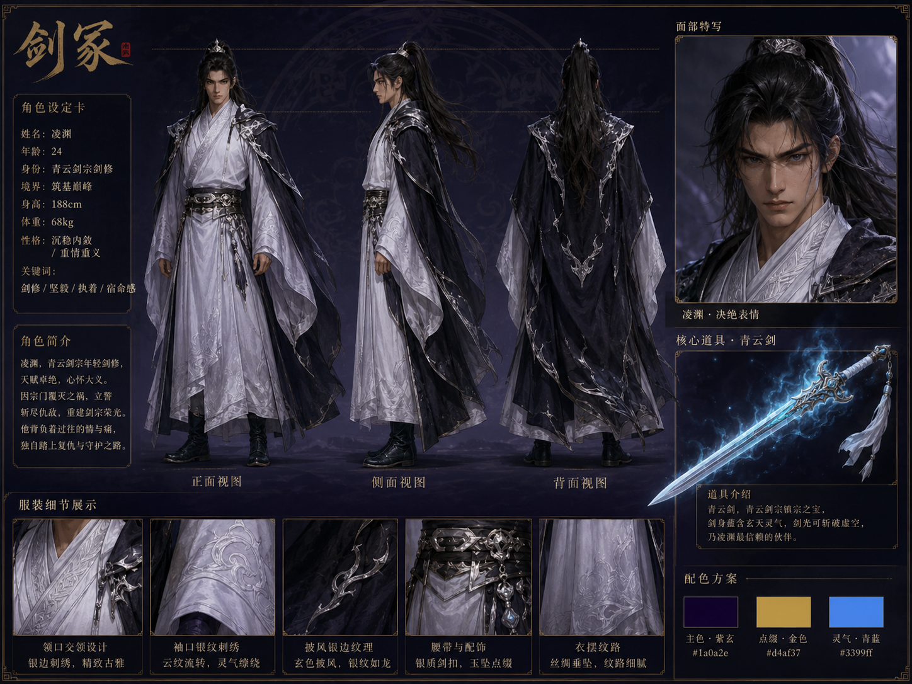
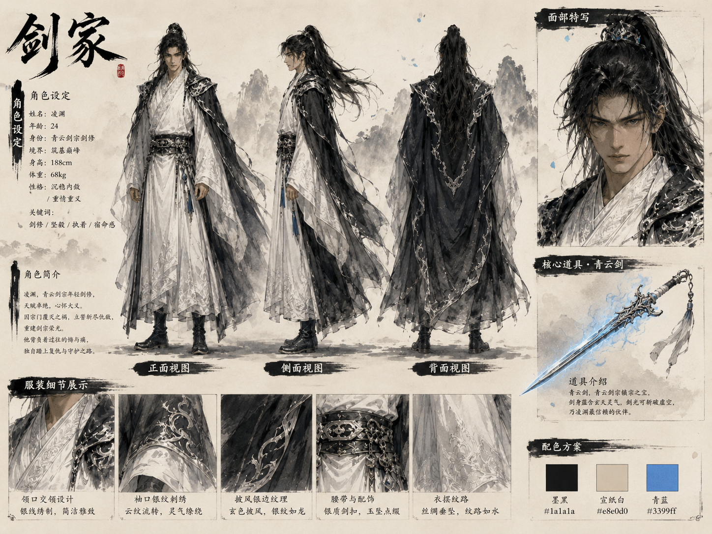
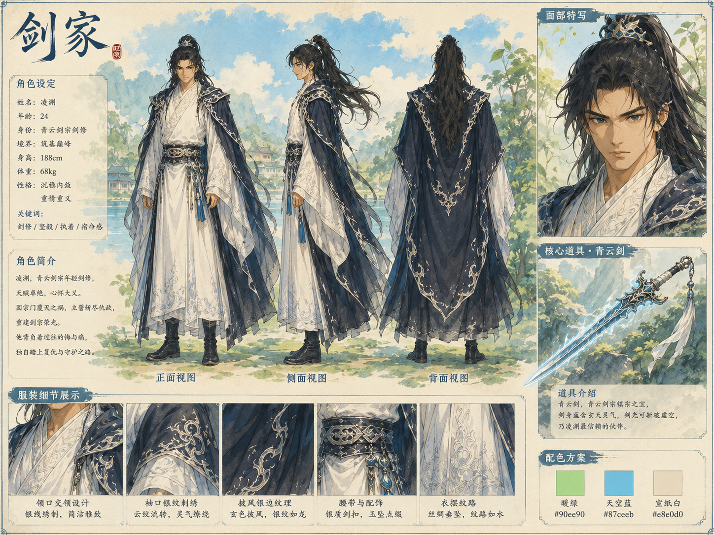

# AI Visual Director

<p align="center">
  <a href="./README.md">中文</a> · <a href="./README.en.md"><b>🇬🇧 English</b></a>
</p>

> From story to visuals — a complete production pipeline

AI Visual Director transforms any story, novel, or script into cinematic visual development proposals. 30 core capabilities, 34 reference files, covering the complete workflow from **input → analysis → generation → scoring → checking → editing → export → video → industry formats**.

Supports GPT Image 2 / Midjourney v6 / Stable Diffusion XL / Sora / Runway / Kling.

---

## Capability Matrix



---

## Quick Start

### Default Mode (recommend first, you choose, then generate)

```
You: [paste your story]
AI: [Smart Recommendation] Based on your story, here are the best matches...
     Recommend 1 (best match): Style X + Format Y — reason
     Recommend 2 (backup):     Style A + Format B — reason
     Recommend 3 (different):  Style C + Format D — reason
You: 1          ← Reply with number to confirm, or say "全来" for 4 at once
AI: [Full prompt]
```

### Quick Mode (skip recommendations, output directly)

| Command | Effect |
|---------|--------|
| `一键生成` (one-click generate) | Full pipeline auto, no options shown |
| `一键全平台` (one-click all platforms) | Full pipeline + GPT/MJ/SD outputs |
| `一键多版本` (one-click multi-version) | Full pipeline + A/B/C comparison |
| `一键全来` (one-click everything) | 3 styles × 4 formats × 3 platforms = 36 prompts |
| `全来` | 4 most relevant format prompts |

---

## Examples

### Example 1: Eastern Fantasy · Enemy Duel

```
You: In a cultivation world, two sword cultivators duel at a sword tomb, they were once master and apprentice
AI: [Smart Recommendation]
  Recommend 1: Style 3 (Eastern Fantasy) + Format 1 (Full Board, with master-apprentice relationship bonus)
  Recommend 2: Style 32 (Chinese Ink) + Format 5 (Poster)

You: 1
AI: [Full board prompt with master-apprentice composition bonus]
```


> Enemy Duel · Eastern Fantasy · Full Board · R3 Master-Apprentice Relationship

---

### Example 2: Urban Scene · Rain Night Walker

```
You: Rainy night, a person walking alone on a city overpass, very sorrowful
AI: [Smart Recommendation]
  Recommend 1 (best match): Style 5 (Urban Emotion Film) + Format 4 (Scene Concept Card)
  Recommend 2 (backup): Style 27 (Wong Kar-wai) + Format 7 (Mood Board)

You: 1
AI: [Full scene concept card prompt]
```


> Rain Night Walker · Urban Emotion Film Board · Scene Concept Card

---

### Example 3: BL · Office Ambiguity

```
You: Office setting, two male leads, more ambiguous tension
AI: [Smart Recommendation]
  Recommend 1: Style 5 (Urban Emotion) + R14 (Ambiguous Pull) + Format 4 (Scene Concept Card)
  Recommend 2: Style 27 (Wong Kar-wai) + Format 5 (Poster)

You: 1
AI: [Ambiguous scene prompt with R14 relationship bonus]
```


> Office Ambiguity · Urban Emotion · R14 Ambiguous Pull Relationship

---

### Example 4: Style Fusion · Wong Kar-wai × Ghibli

```
You: Transform the rain night scene into Wong Kar-wai × Ghibli fusion style
AI: [Fusion style prompt, 60% Wong Kar-wai neon + 40% Ghibli watercolor]
```


> Style Fusion · Wong Kar-wai Neon × Ghibli Watercolor

---

### Example 5: Multi-Version Comparison

```
You: Show me multiple versions
AI: [Version A: Eastern Fantasy] [prompt A]
    [Version B: Chinese Ink] [prompt B]
    [Version C: Ghibli] [prompt C]
```


> Version A · Eastern Fantasy


> Version B · Chinese Ink


> Version C · Ghibli

---

### Example 6: One-Click All Platforms

```
You: 一键全平台 (all platforms)
AI: [GPT Image 2 version] [Full Chinese description]
    [Midjourney v6 version] [English + --cref + --v 6]
    [Stable Diffusion XL version] [Positive/Negative/Params]
```

---

## Full Capability List

### Visual Capabilities (5)

| Capability | Description |
|------------|-------------|
| **32 Visual Styles** | Black-gold action → Chinese ink, including Disney/Pixar/Ghibli/Wong Kar-wai/Zhang Yimou/Wes Anderson/Tim Burton |
| **Style Fusion Engine** | "Wong Kar-wai + Ghibli" auto-fusion, 60% primary + 40% secondary, 23 preset combos |
| **Mood Slider** | More intense/cruel/sweet/depressing/ambiguous/horror/epic/healing/tense/dreamy |
| **Color Narrative Engine** | Colors evolve with emotion, 5 narrative models, color psychology mapping |
| **Style Migration** | Cross-style transfer while keeping character DNA intact |

### Character Capabilities (4)

| Capability | Description |
|------------|-------------|
| **15 Relationship Types** | Enemies to lovers/mutual crush/master-apprentice/age gap/marriage first/redemption/forced/comrades, each × 4 style bonuses |
| **Character DNA Consistency** | 13-field DNA anchor, cross-shot clothing/hair/facial consistency |
| **Series/Sequel Support** | "Episode 2/continue" auto-extends DNA/colors/scenes, tracks state changes |
| **Continuity Checking** | Auto-checks timeline/space/character/emotion continuity, flags breaks |

### Narrative Capabilities (4)

| Capability | Description |
|------------|-------------|
| **Three-Act Structure** | Auto-splits setup(25%)/confrontation(50%)/resolution(25%), matches shots/colors/rhythm per act |
| **Emotion Curve Driven** | Calm → confrontation → climax → aftermath, dynamically adjusts shot size/camera/lighting/color |
| **Pacing Engine** | Quick-cut/standard/slow/progressive/comedy, 5 rhythm modes auto-matched |
| **Music & SFX Reference** | Auto-recommends music mood + SFX per act/shot, 6 music type mappings |

### Output Capabilities (5)

| Capability | Description |
|------------|-------------|
| **10 Output Formats** | Full board/quick storyboard/character card/scene card/poster/manga panel/mood board/4-panel/3-view/keyframe |
| **Multi-Version A/B/C** | 3 different visual interpretations of the same story |
| **Multi-Aspect Adaptive** | 16:9/9:16/1:1/2:3/21:9/32:9, one-click switch |
| **Industry Format Export** | Storyboard Pro / FrameForge / Celtx standard formats |
| **Batch Story Processing** | Auto-split novel chapters into scenes, batch generate storyboards |

### Workflow Capabilities (6)

| Capability | Description |
|------------|-------------|
| **One-Click Workflow** | "一键生成/全平台/多版本/全来" full pipeline auto |
| **Precise Single-Shot Edit** | "Shot 3 darker/longer hair/rain to snow" edit only specified shot, DNA propagation |
| **Prompt Quality Scorer** | 0-100 auto-evaluation, 9 dimensions, auto-optimize if below 75 |
| **Prompt Version Management** | Records edit history, "rollback to v2/compare v1 vs v3" |
| **Prompt Compression** | Auto-compress to MJ(1000 words)/SD(380 words)/Kling(500 chars) optimal length |
| **Thumbnail Storyboard** | Keyword-based quick validation, full version after confirmation |

### Extended Capabilities (6)

| Capability | Description |
|------------|-------------|
| **Video Prompt Adapter** | Storyboard → Sora/Runway/Kling, with motion direction and duration |
| **Cultural Accuracy** | Precise Eastern/Western/Japanese descriptions, no cross-contamination |
| **Director Notes** | Rationale for lens/color/character arc/rhythm choices |
| **Multi-Platform Deep Optimization** | MJ --cref consistency / SD ControlNet / GPT layout maximization |
| **Auto Negative Prompts** | Style/format/relationship/platform-specific negative prompts |
| **Batch Mode** | "全来" outputs 4 most relevant formats |

---

## File Structure

```
ai-visual-director/
├── SKILL.md                          # Main entry: workflow + capability matrix + execution rules
├── README.md                         # Project documentation (Chinese)
├── README.en.md                      # Project documentation (English)
├── examples/                         # Example output images
├── references/                       # Reference files (34)
│   ├── styles.md                     # 32 visual styles
│   ├── fusion.md                     # Style fusion engine
│   ├── formats.md                    # 10 output formats
│   ├── relationships.md              # 15 character relationships
│   ├── character-dna.md              # Character consistency DNA
│   ├── emotion-curve.md              # Emotion curve driven storyboarding
│   ├── color-narrative.md            # Color narrative engine
│   ├── mood-slider.md                # Mood slider (10 dimensions)
│   ├── pacing.md                     # Pacing engine
│   ├── camera.md                     # Camera language reference
│   ├── lighting.md                   # Lighting & color reference
│   ├── composition.md                # Composition & layout reference
│   ├── quality.md                    # Quality constraints
│   ├── platform.md                   # Multi-platform adaptation
│   ├── platform-advanced.md          # Platform deep optimization
│   ├── negative-prompt.md            # Auto negative prompts
│   ├── multi-version.md              # Multi-version A/B/C
│   ├── series.md                     # Sequel/series support
│   ├── one-click.md                  # One-click workflow
│   ├── video-prompt.md               # Video prompt adapter
│   ├── single-shot-edit.md           # Precise single-shot editing
│   ├── audio-reference.md            # Music & SFX reference
│   ├── industry-export.md            # Industry format export
│   ├── thumbnail-board.md            # Thumbnail storyboard
│   ├── director-notes.md             # Director notes
│   ├── prompt-scorer.md              # Prompt quality scorer
│   ├── continuity-check.md           # Continuity checking
│   ├── multi-aspect.md               # Multi-aspect adaptation
│   ├── version-control.md            # Prompt version management
│   ├── style-migration.md            # Style migration
│   ├── prompt-compression.md         # Prompt compression
│   └── batch-chapter.md              # Batch chapter processing
└── templates/                        # Template files (7)
    ├── full-board.md                 # Full board template
    ├── quick-board.md                # Quick storyboard + keyframe sequence
    ├── character-sheet.md            # Character sheet + 3-view
    ├── scene-card.md                 # Scene concept card
    ├── poster.md                     # Poster template
    ├── manga-page.md                 # Manga panel + 4-panel
    └── mood-board.md                 # Mood board template
```

---

## Command Quick Reference

### Core Commands

| Command | Effect |
|---------|--------|
| `[story content]` | Smart recommendation of 2-3 best combinations |
| `一键生成` | Full pipeline auto, no options shown |
| `一键全平台` | Full pipeline + GPT/MJ/SD |
| `一键多版本` | A/B/C three version comparison |
| `一键全来` | 36 prompts (3 styles × 4 formats × 3 platforms) |
| `看全部` | Show all 32 styles + 10 formats |
| `全来` / `批量` | Output 4 most relevant formats |

### Adjustment Commands

| Command | Effect |
|---------|--------|
| `更燃` / `更虐` / `更甜` / `更丧` | Mood slider (more intense/cruel/sweet/depressing) |
| `更暧昧` / `更恐怖` / `更史诗` | Mood slider (more ambiguous/horror/epic) |
| `更贵` | Enhance photography specs/material/layout |
| `小红书竖版` | Change aspect ratio to 9:16 |
| `适配抖音` / `适配朋友圈` | Multi-aspect switching |

### Edit Commands

| Command | Effect |
|---------|--------|
| `第X镜暗一点` / `换长发` / `雨改雪` | Precise single-shot editing |
| `换成X风格但保持角色` | Style migration, DNA preserved |
| `回滚到第2版` | Version rollback |
| `对比v1和v3` | Version comparison |
| `压缩到MJ` / `压缩到SD` | Prompt compression |
| `检查连续性` | Continuity check report |
| `评分` | Prompt quality score |

### Extended Commands

| Command | Effect |
|---------|--------|
| `转视频` | Storyboard → Sora/Runway/Kling |
| `用MJ` / `用SD` | Switch platform format |
| `多版本` / `A/B/C` | Three version comparison |
| `加导演阐述` | Add director notes |
| `导出 Storyboard Pro` | Industry format export |
| `处理这一章` | Batch chapter processing |
| `第X集` / `继续` | Sequel mode |
| `缩略版` | Keyword quick validation |
| `全平台` | GPT/MJ/SD three platforms |

---

## Platform Comparison

| Feature | GPT Image 2 | Midjourney v6 | Stable Diffusion XL |
|---------|-------------|---------------|---------------------|
| Chinese Input | ✅ Native support | ⚠️ Needs translation | ❌ Not supported |
| Layout | ⭐⭐ Best | ⭐ Single image | ⭐ Needs ControlNet |
| Character Consistency | ⭐⭐ Medium | ⭐⭐⭐ --cref | ⭐⭐⭐ IP-Adapter |
| Best For | Full board/manga/mood board | Poster/character/scene | Character sheet/local batch |

---

## Installation

### Option 1: npx skills (Recommended)

```bash
# Global install — available in all projects
npx skills add jijiutong/ai-visual-director -g -y

# Project-level — available only in current project
npx skills add jijiutong/ai-visual-director
```

After installation, Claude Code auto-discovers the skill. Paste any story in conversation to start.

### Option 2: Manual Install

```bash
git clone git@github.com:jijiutong/ai-visual-director.git
```

Place `SKILL.md` along with `references/` and `templates/` into `~/.claude/skills/ai-story-board/` (global) or `<project>/.claude/skills/ai-story-board/` (project-level).

### Option 3: Use Directly

No installation needed. In Claude Code, simply say:
```
帮我做这个故事板：[paste your story]
```

AI will generate prompts following the SKILL.md instructions.

---

## License

MIT
