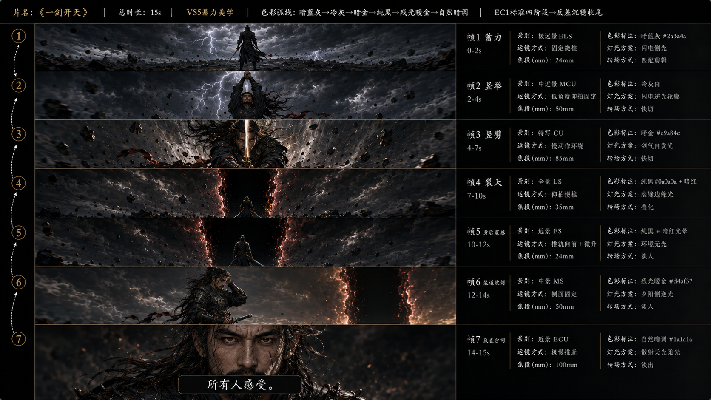
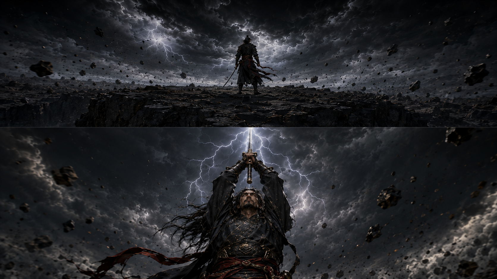
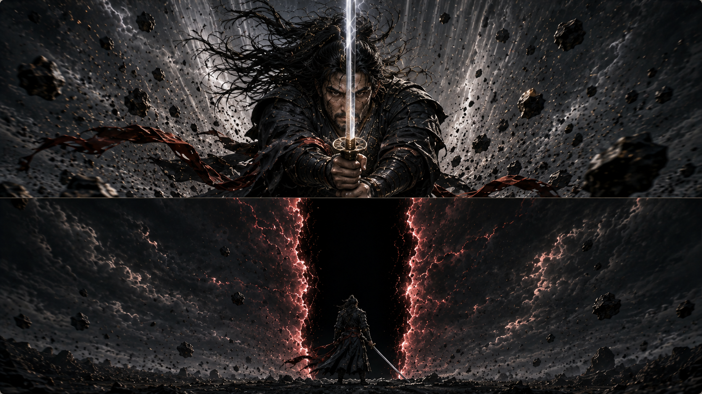
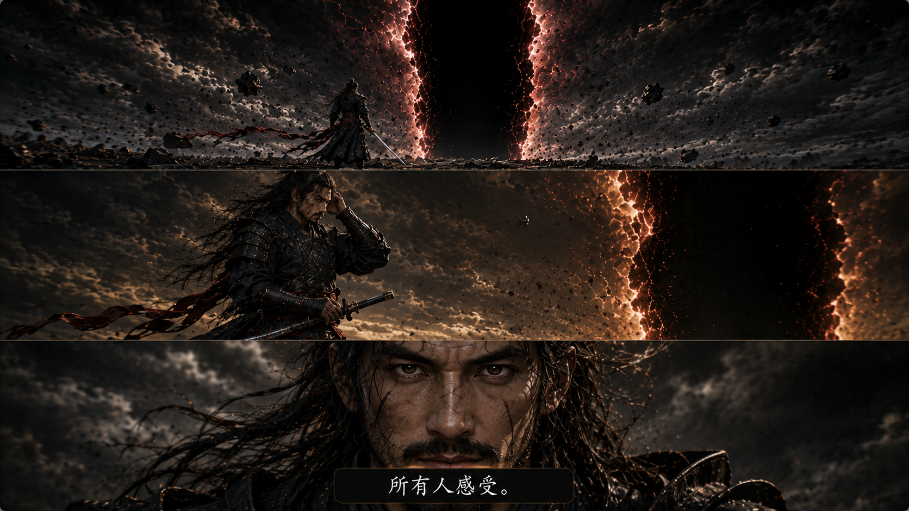
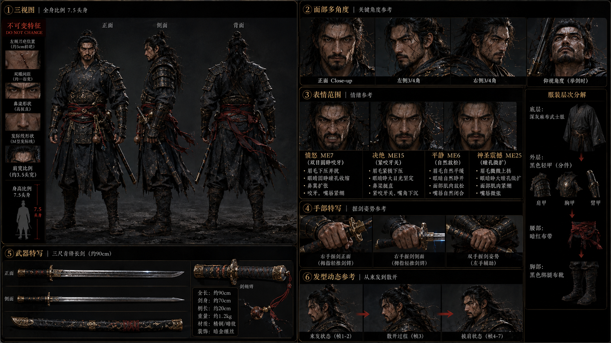

# AI Visual Director

<p align="center">
  <a href="./README.md"><b>中文</b></a> · <a href="./README.en.md">English</a>
</p>

> 从故事到视觉，一条完整生产管线

AI 视觉导演 — 从故事到视频的完整生产管线。52项核心能力，51个参考文件。

**输入 → 分析 → 生成 → 锚定 → 续写 → 衔接 → 导出 → 视频**

支持 9 图片平台 + 5 视频平台 API 直接调用，Obsidian Vault 一键读取。

---

## `/skill` 快捷命令（6个子模块）

不想记触发词？直接用 `/` 命令：

| 命令 | 功能 | 示例 |
|------|------|------|
| `/storyboard` | 故事板分镜生成 | `/storyboard 雨夜，一个人走在天桥上` |
| `/character` | 角色设计（8种一致性方法） | `/character 剑客，白发，青袍` |
| `/scene` | 场景设计（7种场景锁定方法） | `/scene 赛博朋克地下城` |
| `/poster` | 电影海报（竖版/横版） | `/poster 剑冢对决` |
| `/video` | AI视频全流程 | `/video 一剑开天15s分镜` |
| `/style` | 风格浏览器/融合/迁移 | `/style 王家卫 + 吉卜力` |

安装完整 skill 即可使用全部 `/storyboard`、`/character`、`/scene`、`/poster`、`/video`、`/style` 命令。
也可以单独安装子模块：将 `sub-skills/<名称>/SKILL.md` 复制到 `~/.claude/skills/<名称>/SKILL.md`。

---

## 能力矩阵


### 输入能力（2项）
直接粘贴故事 | Obsidian Vault 读取（扫描目录→选章节+时长+分镜数→批量生成）

### 视觉能力（9项）
50+ 种视觉风格 | 风格融合引擎 | 140+ 镜头技术 | 40+ 灯光方案 | Mood 滑块（24维） | 60+ 色彩叙事 | 43种微表情 | 台词节奏标注 | 风格迁移

### 角色能力（5项）
30+ 种角色关系 | 8 种人物一致性方法（角色卡/三视图/面部5角度/12表情/服装武器细节/14图参考/IP-Adapter/DNA文字） | 角色一致性 DNA（20字段） | 续集/系列支持 | 连续性检查

### 场景能力（1项）
7 种场景一致性方法（俯拍图/4宫格/9宫格/全能参考/720°全景图/环绕视频截图/文字场景锁定）

### 叙事能力（6项）
12种叙事结构 | 情绪曲线驱动 | 分镜节奏引擎 | AI 自动续写下一段剧情 | 36 种导演衔接技法 | 跨段连续性保障（硬锁定/软锁定/歧义检测）

### 视频工作流能力（4项）
推荐流程（前置准备→全景→分镜→Prompt→视频） | Seedance 完整版/简略版 | 长视频跨段衔接（尾帧→首帧锚定） | 视频生成后 10 项检查清单

### 输出能力（5项）
10 种输出格式 | 多版本 A/B/C | 多画幅自适应 | 行业格式导出 | 批量故事处理

### 工作流能力（6项）
一键工作流 | 精准单镜修改 | Prompt 质量评分 | Prompt 版本管理 | Prompt 压缩引擎 | 缩略故事板速出

### 扩展能力（16项）
36种生物设计 | 36种环境设计 | 46种道具器物 | 26种天气大气 | 46种身体语言 | 36种材质质感 | 36种动物设计 | 15种历史时代 | 视频 Prompt 适配 | 视频工作流 | 视频角色卡 | 文化精准度 | 导演阐述 | 多平台深度优化 | 负面词自动生成 | 转场与蒙太奇 | 声音设计

### API 集成能力（2项）
9 平台图片 API（GPT Image/Nano Banana/Flux/Ideogram/通义万相/ComfyUI/SD/Recraft） | 5 平台视频 API（Seedance/Runway/可灵/Luma/Pika）

---

## 安装

### 方式一：npx skills 安装（推荐）

```bash
# 全局安装 — 所有项目可用
npx skills add jijiutong/ai-visual-director -g -y

# 项目级安装 — 仅当前项目可用
npx skills add jijiutong/ai-visual-director
```

安装后 Claude Code 自动发现，在对话中粘贴故事即可使用。

### 方式二：手动安装

```bash
git clone https://github.com/jijiutong/ai-visual-director.git
```

将 `SKILL.md` 及 `references/`、`templates/` 放入 `~/.claude/skills/ai-story-board/`（全局）或 `<project>/.claude/skills/ai-story-board/`（项目级）。

### 方式三：直接用

不做任何安装，在 Claude Code 中直接说：
```
帮我做这个故事板：[粘贴你的故事片段]
```

AI 会根据 SKILL.md 的指令自动生成 prompt。


---

## `/xxx` 命令（6 个子技能）

不想记触发词？直接用 `/` 命令：

| 命令 | 功能 | 示例 |
|------|------|------|
| `/storyboard` | 快速故事板 | `/storyboard 雨夜，一个人走在天桥上` |
| `/character` | 角色设计（8种一致性方法） | `/character 剑修师父，白发青衣` |
| `/scene` | 场景设计（7种锁场景方法） | `/scene 赛博朋克地下城` |
| `/poster` | 电影海报（竖版/横版） | `/poster 剑冢决` |
| `/video` | AI 视频全流程 | `/video 一剑开天的15s分镜` |
| `/style` | 风格浏览/融合/迁移 | `/style 王家卫+吉卜力` |

安装完整 skill 后直接使用 `/storyboard`、`/character`、`/scene`、`/poster`、`/video`、`/style`。
也可单独安装某个子技能：将 `sub-skills/<name>/SKILL.md` 复制到 `~/.claude/skills/<name>/SKILL.md`。

---

## 快速开始

### 默认模式（先推荐，你确认后生成）

```
你：[粘贴你的故事片段]
AI：【智能推荐】根据你的故事，推荐以下组合...
     推荐 1（最匹配）：风格 X + 格式 Y — 理由
     推荐 2（备选）：  风格 A + 格式 B — 理由
     推荐 3（不同视角）：风格 C + 格式 D — 理由
AI：```[完整 prompt]```
```

### 快捷模式（跳过推荐，直接输出）

| 指令 | 效果 |
|------|------|
| `一键生成` | 全流程自动完成，不展示选项 |
| `一键全平台` | 全流程 + GPT/MJ/SD 三平台输出 |
| `一键多版本` | 全流程 + A/B/C 三版本对比 |

---

## 示例

### 示例 0：AI 视频全流程 · 一剑开天

```
你：中国武士一剑开天的 15s 分镜
AI：【智能推荐】1. 黑金动作 + 1. 全案板

你：1
→ 【第一步】生成角色卡 + 全能参考图（2 张，锁定角色+场景+光照）
→ 【第二步】生成 720° 全景图（6 面拼接，锁定全局空间）
→ 【第三步】生成 3 张视频分镜图（合并帧）
→ 【第四步】出视频 prompt（压缩模式 ≤1500 字）
→ 【第五步】prompt + 角色卡 + 全景图 + 3 张分镜图 → 输入 Seedance
→ 一键生成 15s 完整视频 | 总出图 11 张 | 总费用 ~$0.94 | 总耗时 ~5min
```

**完整生产管线素材：**


> 故事板（主参考）— 运镜/节奏/时间线/转场的绝对主线


> 分镜图 1（画面锚点）— 蓄力+竖举合并帧


> 分镜图 2（画面锚点）— 竖劈+裂天合并帧


> 分镜图 3（画面锚点）— 身后+收剑+台词合并帧


> 角色设定卡（角色锚点）— 三视图/面部/表情/手部/武器/发型+不可变标注

---

### 示例 1：东方玄幻 · 宿敌对决

```
你：修仙世界，两位剑修在剑冢对决，他们曾经是师徒
AI：【智能推荐】
  推荐 1：3. 东方玄幻 + 1. 全案板（含师徒关系加成）
  推荐 2：32. 中国水墨 + 5. 海报

你：1
AI：```[全案板 prompt，含师徒关系构图加成]```
```


> 宿敌对决 · 东方玄幻 · 全案板 · R3师徒关系加成

---

### 示例 2：都市场景 · 雨夜独行

```
你：雨夜，一个人走在城市天桥上，很悲伤
AI：【智能推荐】
  推荐 1（最匹配）：5. 都市情绪电影板 + 4. 场景概念卡
  推荐 2（备选）：27. 王家卫情绪 + 7. 情绪板

你：1
AI：```[完整场景概念卡 prompt]```
```


> 雨夜独行 · 都市情绪电影板 · 场景概念卡

---

### 示例 3：BL · 办公室暧昧

```
你：办公室play，两个男主，更暧昧
AI：【智能推荐】
  推荐 1：5. 都市情绪 + 14. 暧昧拉扯关系 + 4. 场景概念卡
  推荐 2：27. 王家卫 + 5. 海报

你：1
AI：```[暧昧场景 prompt，含R14关系加成]```
```


> 办公室暧昧 · 都市情绪 · R14暧昧拉扯关系加成

---

### 示例 4：风格融合 · 王家卫 × 吉卜力

```
你：把雨夜独行换成王家卫+吉卜力的融合风格
AI：```[融合风格 prompt，60%王家卫霓虹+40%吉卜力手绘水彩]```
```


> 风格融合 · 王家卫霓虹 × 吉卜力手绘水彩

---

### 示例 5：多版本对比

```
你：多版本看看
AI：【版本 A：东方玄幻】[prompt A]
    【版本 B：中国水墨】[prompt B]
    【版本 C：吉卜力】[prompt C]
```


> 版本 A · 东方玄幻


> 版本 B · 中国水墨


> 版本 C · 吉卜力

---

### 示例 6：一键全平台

```
你：一键全平台
AI：【GPT Image 2 版本】[中文完整描述]
    【Midjourney v6 版本】[英文 + --cref + --v 6]
    【Stable Diffusion XL 版本】[正面/负面/参数]
```

---

## 命令速查

### 输入指令

| 指令 | 效果 |
|------|------|
| `[故事内容]` | 直接粘贴，智能推荐 2-3 个最佳组合 |
| `从 Obsidian 读取 [目录]` | 扫描 Obsidian Vault 目录，展示章节/角色/场景清单 |
| `Obsidian 读取 [目录] 全部 15s 7镜` | 快捷：全章批量，指定时长+分镜数 |

### 核心指令

| 指令 | 效果 |
|------|------|
| `一键生成` | 全流程自动，不展示选项 |
| `一键全平台` | 全流程 + GPT/MJ/SD |
| `一键多版本` | A/B/C 三版本对比 |
| `看全部` | 展示 53 种风格 + 10 种格式 |

### /skill 快捷命令

6 个 `/skill` 命令直通子模块：

| 命令 | 效果 | 示例 |
|------|------|------|
| `/storyboard` | 故事板分镜生成 | `/storyboard 雨夜古寺两人对决` |
| `/character` | 角色设计（8种一致性方法） | `/character 墨渊 黑衣剑客` |
| `/scene` | 场景概念图（7种锁定方法） | `/scene 古寺大殿 雨夜` |
| `/poster` | 电影海报生成 | `/poster 雨夜剑鸣` |
| `/style` | 风格浏览/融合/迁移 | `/style 东方玄幻 + 水墨` |
| `/video` | AI视频全流程 | `/video 转视频` |

所有 `/skill` 命令支持追加参数，如 `/storyboard 一键生成`、`/character 全部`。

### 场景一致性

| 指令 | 效果 |
|------|------|
| `生成场景参考图` / `场景锚点` | 选择锁场景方法 |
| `全能参考图` / `all-in-one` | 一张锁场景+角色+光照+道具 |
| `生成全景图` / `720全景` | 360°×180° 全景环境图 |
| `环绕截图` / `视频截图法` | 环绕视频→截8角度帧→拼接 |
| `镜头角度分镜` / `camera remix` | 文字场景锁定·多角度分镜 |

### 人物一致性

| 指令 | 效果 |
|------|------|
| `生成角色卡` | 6 模块角色设定卡 |
| `三视图` | 正/侧/背角色三视图 |
| `面部多角度` | 5 角度面部特写 |
| `12表情` / `表情范围图` | 12 种表情锁定情绪范围 |
| `服装武器细节卡` | 服装+武器独立细节参考 |
| `14图参考` | Nano Banana 最强角色锚定 |
| `IP-Adapter` | ComfyUI 本地角色锁定 |
| `角色 DNA` | 20 字段文字锚定 |

### 视频工作流

| 指令 | 效果 |
|------|------|
| `转视频` | 故事板→推荐流程出视频 |
| `出视频 prompt` | 压缩模式 ≤1500 字，直喂 Seedance |
| `详细模式` / `展开 prompt` | 详细模式 3000+ 字，适合 Runway/可灵 |
| `切分各帧` / `逐帧接力` | 帧间参考链：前一帧作后一帧参考图 |
| `生成视频分镜图` / `合并帧` | 3-4 张合并分镜图 |
| `继续下一段` / `续写下一段` | AI 自动续写下一段剧情+匹配衔接技法 |
| `用 [技法名] 衔接，继续下一段` | 手动指定衔接技法 |
| `下一段往 [方向] 发展` | 手动指定剧情方向 |
| `检查视频` / `视频检查` | 10 项检查清单 |

### API 直接生成

| 指令 | 效果 |
|------|------|
| `配置 API` | 查看 API Key 配置方式 |
| `用 Nano Banana 生成 [格式]` | 调 Gemini API 出图 |
| `用 GPT Image 生成 [格式]` | 调 DALL-E 3 API 出图 |
| `用 Flux 生成 [格式]` | 调 Replicate API 出图 |
| `用 Ideogram 生成 [格式]` | 调 Ideogram API 出图 |
| `用 通义万相 生成 [格式]` | 调 DashScope API 出图 |
| `用 ComfyUI 生成 [格式]` | 调本地 ComfyUI 出图 |
| `用 SD 生成 [格式]` | 调 Stability AI API 出图 |
| `用 Recraft 生成 [格式]` | 调 Recraft API 出图 |
| `用 Seedance 生成视频` | 调火山引擎 Ark 出片 |
| `用 Runway 生成视频` | 调 Runway API 出片 |
| `用 可灵 生成视频` | 调 DashScope API 出片 |
| `用 Luma 生成视频` | 调 Luma API 出片 |
| `用 Pika 生成视频` | 调 fal.ai Pika 出片 |

### 调整指令

| 指令 | 效果 |
|------|------|
| `更燃` / `更虐` / `更甜` / `更丧` | Mood 滑块 |
| `更暧昧` / `更恐怖` / `更史诗` | Mood 滑块 |
| `更贵` | 强化摄影参数/材质/版式 |
| `小红书竖版` | 画幅改 9:16 |
| `适配抖音` / `适配朋友圈` | 多画幅切换 |
| `第X镜暗一点` / `换长发` / `雨改雪` | 精准单镜修改 |
| `换成X风格但保持角色` | 风格迁移 |
| `回滚到第2版` | 版本回滚 |
| `压缩到MJ` / `压缩到SD` | Prompt 压缩 |
| `检查连续性` | 连续性检查报告 |
| `评分` | Prompt 质量评分 |
| `加导演阐述` | 追加导演注释 |
| `导出 Storyboard Pro` | 行业格式导出 |
| `第X集` / `继续` | 续集模式 |
| `处理这一章` | 批量故事处理 |

---

## 文件结构

```
ai-visual-director/
├── SKILL.md                          # 主入口：工作流 + 能力矩阵 + 执行规则
├── README.md                         # 项目文档
├── api-config.template.env           # API Key 配置模板（14 平台）
├── sub-skills/                       # 子技能（6个独立 /xxx 命令入口）
│   ├── storyboard/SKILL.md           # /storyboard 快速故事板
│   ├── character/SKILL.md            # /character 角色设计
│   ├── scene/SKILL.md                # /scene 场景设计
│   ├── poster/SKILL.md               # /poster 电影海报
│   ├── video/SKILL.md                # /video 视频全流程
│   └── style/SKILL.md                # /style 风格浏览器
├── examples/                         # 示例效果图
│   ├── rain-night-scene.jpg          # 都市场景示例
│   ├── enemy-duel-board.jpg          # 玄幻对决示例
│   ├── office-romance.jpg            # BL暧昧示例
│   ├── wong-ghibli-fusion.jpg        # 风格融合示例
│   ├── multi-version-compare.jpg     # 多版本对比示例
│   └── full-pipeline.jpg             # 全管线示例
├── references/                       # 参考文件（51个）
│   ├── styles.md                     # 50+种视觉风格详细说明
│   ├── fusion.md                     # 风格融合引擎
│   ├── formats.md                    # 10种输出格式说明
│   ├── relationships.md              # 30+种角色关系
│   ├── act-structure.md              # 12种叙事结构模型
│   ├── emotion-curve.md              # 12种情绪曲线模型
│   ├── color-narrative.md            # 60+色彩叙事方案
│   ├── mood-slider.md                # Mood滑块（24种维度）
│   ├── negative-prompt.md            # 负面提示词自动生成
│   ├── multi-version.md              # 多版本A/B/C对比
│   ├── series.md                     # 续集/系列支持
│   ├── character-dna.md              # 20字段角色DNA+状态追踪
│   ├── pacing.md                     # 分镜节奏引擎
│   ├── cultural-accuracy.md          # 文化精准度（各朝代/各国家）
│   ├── camera.md                     # 140+镜头技术（9大分类）
│   ├── lighting.md                   # 40+灯光方案+电影色板
│   ├── micro-expressions.md          # 43种Ekman微表情+8种眼神路径
│   ├── dialogue-rhythm.md            # 台词节奏标注（停顿/重音/语速/沉默）
│   ├── composition.md                # 35+构图法则（经典/情感/色彩/光影）
│   ├── quality.md                    # 100+AI错误库+质量约束
│   ├── platform.md                   # 多平台格式适配（GPT2-3/MJv6-7/SDXL-3/DALL-E3）
│   ├── platform-advanced.md          # 平台深度优化
│   ├── video-prompt.md               # AI视频Prompt（Sora/Runway/可灵/Luma/Pika）
│   ├── video-prompt-assembly.md      # 视频Prompt组装（故事板为主+角色卡+分镜图锚点）
│   ├── single-shot-edit.md           # 精准单镜修改
│   ├── audio-reference.md            # 音乐音效参考
│   ├── industry-export.md            # 行业格式导出
│   ├── thumbnail-board.md            # 缩略故事板速出
│   ├── director-notes.md             # 导演阐述
│   ├── prompt-scorer.md              # Prompt质量评分器
│   ├── continuity-check.md           # 连续性检查
│   ├── multi-aspect.md               # 多画幅自适应
│   ├── version-control.md            # Prompt版本管理
│   ├── style-migration.md            # 风格迁移
│   ├── prompt-compression.md         # Prompt压缩引擎
│   ├── creatures.md                  # 36种生物/神兽/怪物设计
│   ├── environments.md               # 36种环境/世界观设计
│   ├── props.md                      # 46种道具/武器/法器
│   ├── weather.md                    # 26种天气与大气效果
│   ├── body-language.md              # 46种身体语言/姿态
│   ├── materials.md                  # 36种材质/质感参考
│   ├── transitions.md                # 转场与蒙太奇（5硬切/6软转场/10蒙太奇）
│   ├── sound-design.md               # 声音设计（16环境音/20拟音/12音乐Mood）
│   ├── animals.md                    # 36种动物设计（马匹/猛禽/野兽/神话）
│   ├── historical-eras.md            # 15种历史时代（先秦→太空科幻）
│   ├── api-integration.md             # 图片 API 集成（9 平台）
│   ├── video-api-integration.md       # 视频 API 集成（5 平台）
│   ├── scene-consistency.md           # 场景一致性方法（7 种）
│   ├── character-consistency.md       # 人物一致性方法（8 种）
│   └── batch-chapter.md              # 批量故事处理
└── templates/                        # 模板文件（7个）
    ├── full-board.md                 # 全案板完整模板
    ├── quick-board.md                # 快速故事板 + 关键帧序列
    ├── character-sheet.md            # 角色设定卡 + 三视图设定卡
    ├── scene-card.md                 # 场景概念卡
    ├── poster.md                     # 海报模板
    ├── manga-page.md                 # 漫画分镜页 + 四格漫画
    └── mood-board.md                 # 情绪板模板
```

---

## 平台对比

| 特性 | GPT Image 2 | Midjourney v6 | Stable Diffusion XL |
|------|-------------|---------------|---------------------|
| 中文输入 | ✅ 直接支持 |  需翻译 | ❌ 不支持 |
| 排版能力 | ⭐⭐ 最强 | ⭐ 单图为主 | ⭐ 需ControlNet |
| 角色一致性 | ⭐⭐ 中 | ⭐⭐⭐ --cref | ⭐⭐⭐ IP-Adapter |
| 推荐场景 | 全案板/漫画/情绪板 | 海报/角色/场景 | 角色设定卡/本地批量 |

---

## License

MIT
